# Leen V4 — Product Flow Documentation

This document consolidates the raw flow notes into a structured reference for the **Customer App**, **Partner App**, **Staff App**, and **Admin Dashboard**, plus the cross-cutting **Chat**, **Help & Support**, and **Dispute** systems. It is the source-of-truth flow spec that the Express.js microservices backend will be designed against.

> Backend context: microservice architecture built in Express.js. Each major domain below (Auth/Users, Bookings, Payments/Payouts, Catalog, Support, Disputes, Chat, Notifications, CMS, Admin/RBAC) is expected to map to one or more services.

---

## Table of Contents

1. [Roles & Apps Overview](#1-roles--apps-overview)
2. [Shared / Common Flows](#2-shared--common-flows)
3. [Customer App](#3-customer-app)
4. [Partner App](#4-partner-app)
5. [Staff App](#5-staff-app)
6. [Admin Dashboard](#6-admin-dashboard)
7. [Cross-Cutting: Chat](#7-cross-cutting-chat)
8. [Cross-Cutting: Help & Support](#8-cross-cutting-help--support)
9. [Cross-Cutting: Disputes](#9-cross-cutting-disputes)
10. [Open Questions / Ambiguities](#10-open-questions--ambiguities)

---

## 1. Roles & Apps Overview

| App | Primary Role | Key Responsibilities |
|---|---|---|
| Customer App | Customer | Discover services, book (urgent/scheduled), track job, pay, review, support/dispute |
| Partner App | Partner (business owner) | Onboard via KYB, manage staff, receive/accept job requests, manage services, earnings/payouts |
| Staff App | Partner's Staff (Tasker) | Execute assigned jobs, update job status, chat/call with masked contact, view own ratings |
| Admin Dashboard | Admin / Sub-admin | Manage customers/partners, catalog, pricing, promos, bookings, finance/payouts, disputes, support, CMS, roles |

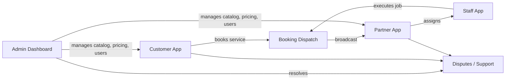

---

## 2. Shared / Common Flows

### 2.1 Reset Password (Customer, Partner, Staff apps)
1. Enter phone number
2. Enter OTP & tap Next
3. Enter new password
4. Login and land on Dashboard

### 2.2 Reset Password (Admin Dashboard)
1. Enter email
2. Link sent to email → open email → click reset link
3. Enter new password
4. Login and land on Dashboard

### 2.3 Language Selection
- Available on splash/onboarding for all apps: **EN / AR**
- Also editable later from Profile → Language

### 2.4 Logout / Delete Account (Customer, Partner apps)
- **Logout:** confirmation popup (Yes/No)
- **Delete account:**
  - Yes → confirm → GDPR data removal → account deleted
  - No → back to profile

---

## 3. Customer App

### 3.1 Onboarding & Auth
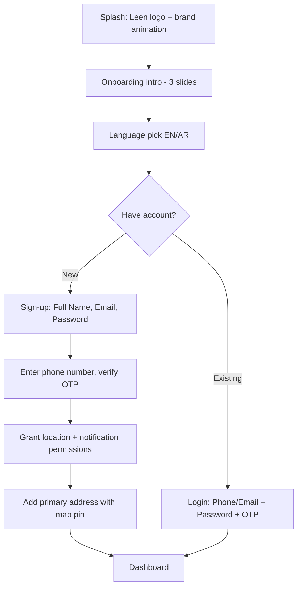
- Reset Password: see [2.1](#21-reset-password-customer-partner-staff-apps)

### 3.2 Dashboard / Home
- Header: Set Address (map pin) + Notification bell + Search bar (direct service search)
- All Categories grid → Select Sub-category
- Smart Suggestions (history-based) + Popular Services carousel
- List of Services → Single Service detail page (what's included)

### 3.3 Services (menu tab)
- Same structure as Dashboard catalog: All Categories → Sub-categories → List of Services → Single Service detail
- Note in source: *"Only for development purpose"* marker next to Payment Success step — flag for QA/staging-only behavior, confirm with stakeholders.

### 3.4 Booking Flow — Urgent Booking
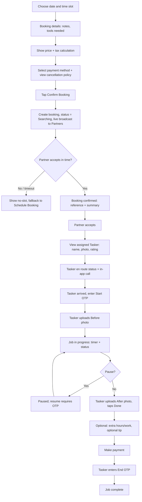

### 3.5 Booking Flow — Scheduled Booking
1. Find earliest slot in 1–2 hours
2. Slot available?
   - **Yes:** Confirm address (use current location) → show earliest slot + ETA → pick payment (card) → booking confirmed → go to Live Tracking → view job status
   - **No:** back to list
- (Shares the live-tracking job-execution steps from the Urgent flow once confirmed: assigned tasker, OTPs, before/after photos, payment, etc.)

### 3.6 My Bookings
- Tabs: **Today Booking / Active / History / Cancelled**
- **Today Booking:** contact partner (in-app call, masked number), view booking details, cancel booking
  - Cancel → show cancellation policy + fee → confirm cancel?
    - Yes → reason for cancellation + apply cancellation fee (if past free window) → refund to original payment method (or add bank details) → booking cancelled
- **Booking detail actions:** view details; if scheduled, modify address within 2 minutes of booking
- **Post-job:** Write a review → star rating (1–5) → optional review text + tags (Punctual, Polite) → submit review
- **History:** view details

### 3.7 Profile & Settings
- **Language:** change language
- **Profile:** edit profile
- **Manage Address:** add/delete address
- **Help & Support:** see [Section 8](#8-cross-cutting-help--support)
- **Disputes:** see [Section 9](#9-cross-cutting-disputes)
- **Terms, Privacy:** static pages
- **Logout / Delete account:** see [2.4](#24-logout--delete-account-customer-partner-apps)

---

## 4. Partner App

### 4.1 Onboarding & KYB (4 steps) & Auth
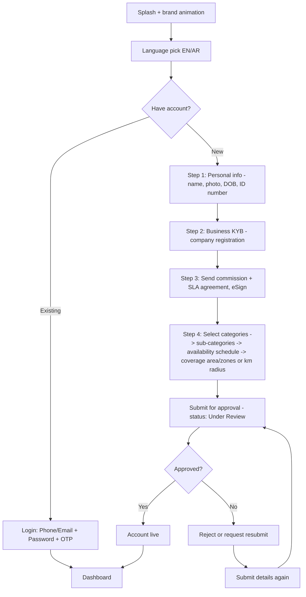
- Reset Password: see [2.1](#21-reset-password-customer-partner-staff-apps)

### 4.2 Dashboard & Job Dispatch
- Online/Offline toggle; quick links: Add Staff Members, New/Scheduled Job, Running Job, Completed Jobs
- Online toggle → opens map, set search radius → receives incoming job requests
- Request Job popup shows: earnings, distance, tools needed, customer notes
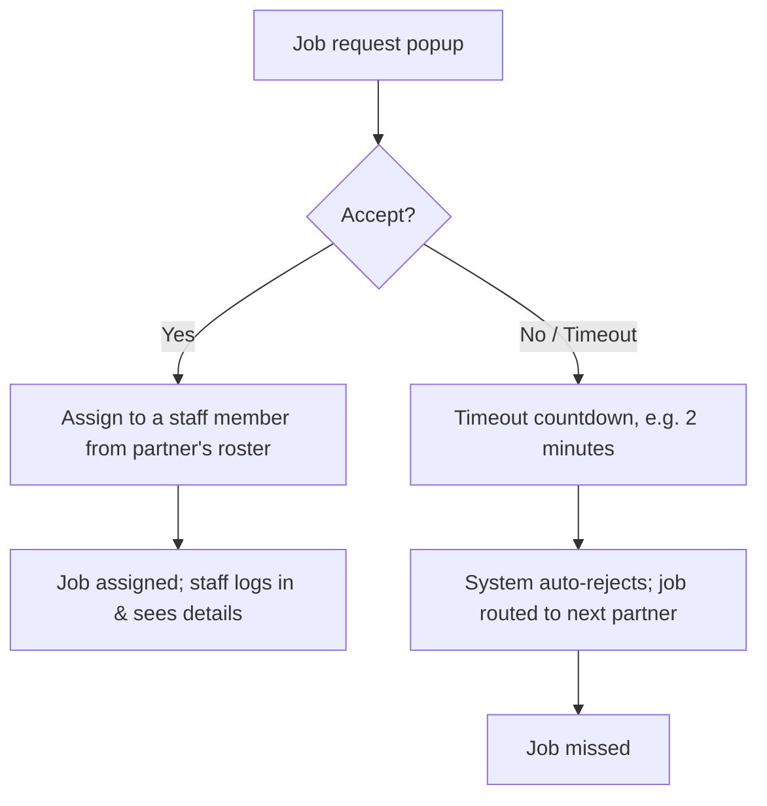

### 4.3 Jobs
- **Schedule Booking:** view details
- **Today Booking:** view status/details
- **All Jobs:** tabs — Today Booking / History / Cancelled
- **History:** view details / review / payment
- **Cancelled**

### 4.4 Staff Management
- **Add New Staff:** name, email, phone, password → add & save
- **All Staff Members:** list → view details (personal details, completed jobs, reviews) → delete member?
  - Yes → confirm + remove all profile data & reviews → account deleted
  - No → back to list

### 4.5 Earnings & Wallet
- Add bank/wallet details for payouts
- Tap Withdraw → shows weekly cap & minimum withdrawal amount → submit payout request → enters Admin queue
- Payout status: **Pending → Processing → Paid** → funds transferred
- **My Earnings:** totals (Today/Week/Month), today's earnings & commission, recent completed jobs (price, commission, rating)

### 4.6 Ratings & Performance
- All profile ratings & reviews (calculated score + list with job titles)
- Performance score: on-time rate, accept rate

### 4.7 Services Management
- **Add new service:** select new category → select radius zone → submit for re-approval → Admin reviews →
  - Approved → service goes live
  - Rejected → keep current service set
- **My Service:** current services list → Remove (soft delete) or Edit (applied immediately)
- Shortcuts: My Jobs, Edit service radius, My Earnings & Wallet

### 4.8 Profile & Settings
- **Language:** change language
- **Profile:** shows **Probation Period** status; edit profile
- **Help & Support:** see [Section 8](#8-cross-cutting-help--support)
- **Disputes:** dispute status set includes **Submitted / Under Review / Need More Evidence / Resolved**
- **Terms, Privacy:** page links
- **Logout / Delete account:** see [2.4](#24-logout--delete-account-customer-partner-apps)

---

## 5. Staff App

### 5.1 Onboarding & Auth
- Splash (logo + animation) → Language pick (EN/AR) → Login → Dashboard
- Reset Password: see [2.1](#21-reset-password-customer-partner-staff-apps)
- Note: Staff accounts are created by their Partner (no self-signup) — see [4.4](#44-staff-management)

### 5.2 Dashboard & Job Execution
- Dashboard sections: New assigned Job, Running Job, Completed Jobs
- New job assignment: only masked call number is available (no other contact info shown)
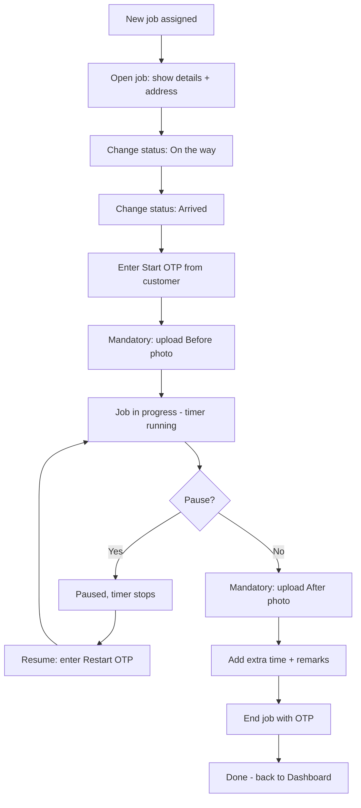

### 5.3 History & Ratings
- **History:** completed jobs with rating
- **My Rating:** all ratings, shown with job title only

### 5.4 Profile
- My Profile
- All Jobs (shortcut to Job section)
- My Rating
- Language
- Logout: confirmation popup (Yes/No)

---

## 6. Admin Dashboard

### 6.1 Auth
- Login: Username/Password
- Reset Password: see [2.2](#22-reset-password-admin-dashboard)

### 6.2 Dashboard Overview
- Widgets: Orders, Customers, Partners, Categories, Sub-Categories, New Bookings, New Partners

### 6.3 Customer Management
- **Add New Customer**
- **All Customers:** open profile → profile details, bookings, payments → action:
  - **Suspend:** set reason + duration → save + notify customer → status: Suspended
  - **Reactivate:** clear flag → status: Active
  - **Delete:** confirm GDPR deletion → anonymise records + delete account → Deleted

### 6.4 Partner Management
- **New partner registration requests:**
  - ID & name match → account approved → notify partner
  - Mismatch/rejected → write rejection reason → notify partner → partner resubmits
- **All Partners:**
  - Suspected fraud → reject + block → add to fraud list → delete account
  - New service request needing a warning → send written warning + in-app message → notify partner
  - **Existing partners:** profile + details + complaint log + all staff reviews → action:
    - **Suspend:** set reason + duration (7–30 days) → notify partner → Suspended
    - **Delete:** remove permanently (serious/fraud) → refund affected customers on open jobs → partner removed, case logged

### 6.5 Location Management (Cities)
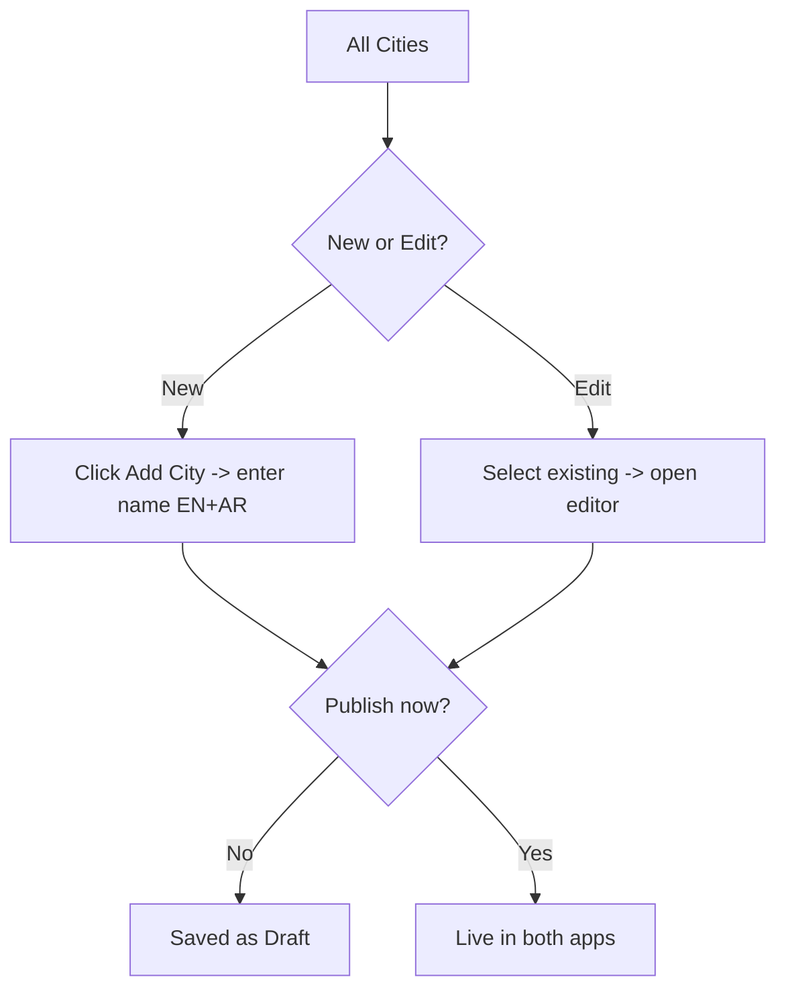

### 6.6 Service & Category Management
- **Sub-Categories:** All Sub-Categories → New (select Main Category, name EN+AR, icon, parent, coverage cities [optional], commission/taxes) or Edit → Publish now? → Draft / Live in both apps
- **Categories:** All Categories → New (name EN+AR, icon, parent) or Edit → Publish now? → Draft / Live in both apps
- **Pricing (Category × Tier):** list of category/tier combos (e.g. Cleaning 1BR/2BR/3BR/Villa, Spa Basic/Premium) → price editor → set base price (OMR), set surge/off-peak window (% adjustment, date range, hours)
- **Job Templates:** Add New Job → select Category → select Sub-Category → open Job Template form (fields adapt to category: price, duration, modifiers) → Publish or Save as Draft (edit later)
- **Publish flow:** Ready to publish? → Yes → Publish to catalog (service catalog goes live) → No → keep editing/draft
- **Catalog → Booking pipeline (system note):** Customer selects a published service and books → broadcast to matching Partners (by category + service area) → first Partner to accept wins → Partner's staff completes the job → job done → two-part rating (customer rates partner/staff, and vice versa where applicable)

> Admin owns the full catalog creation/publishing pipeline; jobs only become bookable by customers once published, and the accept/dispatch/completion loop (Sections 4.2, 5.2) takes over from there.

### 6.7 Promo Codes
- **All Promo Codes:** edit & delete
- **Add New Promo:** select Categories → select Sub-Categories → create code with discount % (expiry, max uses, "Leen absorbs" flag) → Publish or Draft

### 6.8 Booking Management
- **Active Bookings:** check details/status
  - Raise/view Dispute → go to Dispute section
  - No partner response → notify admin → manually assign a Tasker
- **All Bookings:**
  - New Booking: check status, accept/reject, view details → routes to Active Booking section
  - Old/Completed Bookings: view details

### 6.9 Reports
- **Customer Growth:** generate & download PDF
- **All Reports tabs**, e.g. Revenue: set date range + filters (city, category) → preview chart + table → export as CSV or PDF

### 6.10 Finance, Commission & Payouts

**Finance Dashboard:** total earnings, total commission, filters, tables, charts; Partner performance view (filterable)

**Partner Payout flow:**
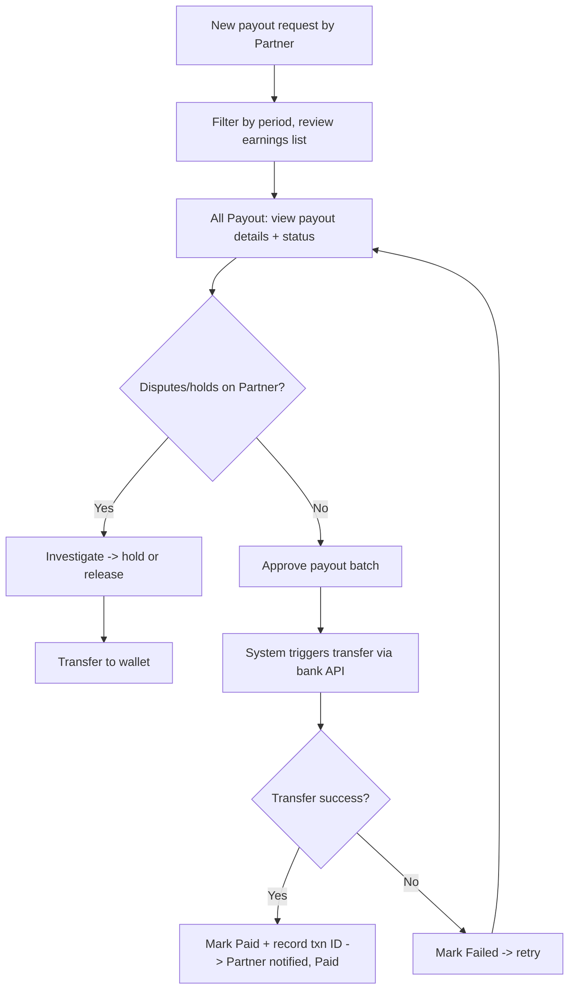

**Customer Refund Payout flow:**
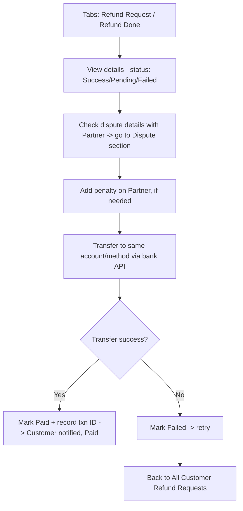

### 6.11 Disputes (Admin)
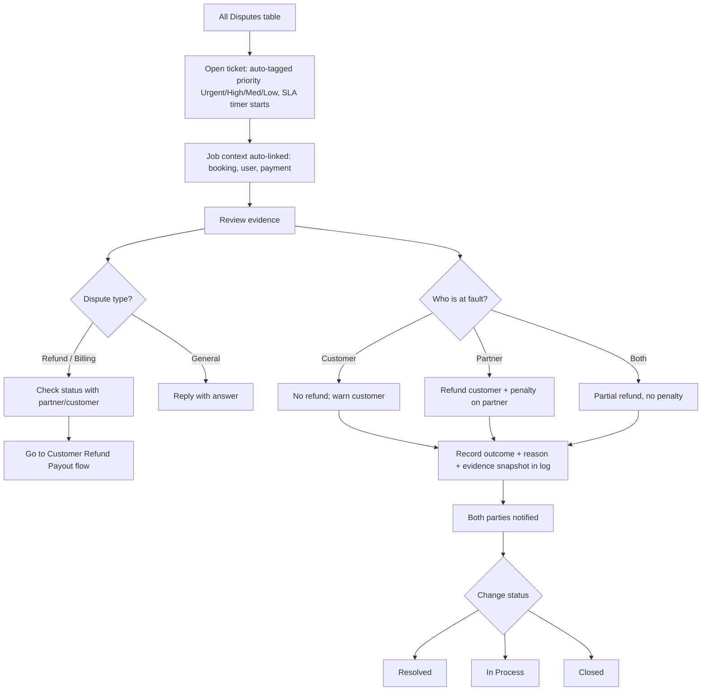
- Admin can also **add a new ticket** manually if needed, select partner/customer, and contact both parties directly.
- Possible decision outcomes referenced in source notes: Full refund to customer, Partial refund to customer, Payout held, False complaint, Cancellation issue, Customer unavailable, Incorrect resolution, Partner paid/payout released (see also [Section 9](#9-cross-cutting-disputes)).

### 6.12 Help & Support (Admin)
- All Help & Support table → open ticket → issue type?
  - **Account:** update account → reply → mark Resolved + notify → Ticket Closed
  - **Technical:** check issue → (same investigate/resolve/reply pattern as Section 8)

### 6.13 CMS
- **Banners:** Add New Banner → select category → add banner → Publish or Draft
- All Banners: list → edit/delete

### 6.14 Role Management (Sub-admins)
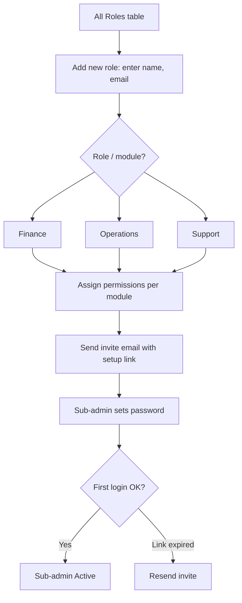
- Permission levels referenced include at least **Read-only** and module-scoped write access (Finance / Operations / Support, etc. — exact module list to confirm).

### 6.15 Admin Profile
- Edit/save profile details
- Reset Password: see [2.2](#22-reset-password-admin-dashboard)
- Logout

---

## 7. Cross-Cutting: Chat

Chat is only available **between Customer and Staff member** (not Partner, not Admin).

Restrictions (apply to both sides):
- Only **pre-defined** messages — no free-text/custom messages
- No audio messages
- No video messages
- No sharing of contact information (phone, email, social handles, etc. — presumably filtered/blocked)

| Side | Chat | Call |
|---|---|---|
| Customer | Chat with Staff member (pre-defined only) | Call with number masked only |
| Staff member | Chat with Customer (pre-defined only) | Call with number masked only |

---

## 8. Cross-Cutting: Help & Support

Available to **Customer, Partner, and Admin** only.

> **Note from source spec:** Help & Support tickets are for **general assistance only**. For booking-related conflicts, refund requests, or disagreements between parties, a **Dispute** must be raised instead (see [Section 9](#9-cross-cutting-disputes)).

### Customer Support Ticket Categories
Booking Issue · Payment Issue · Technical Issue · Account Issue · Offer/Coupon Issue · General Query · Booking Information · Other

### Partner Support Ticket Categories
Account/KYC Issue · Booking Issue · Payout Query · Technical Issue · Profile Issue · General Query · Other Issue

### Flow (both roles)
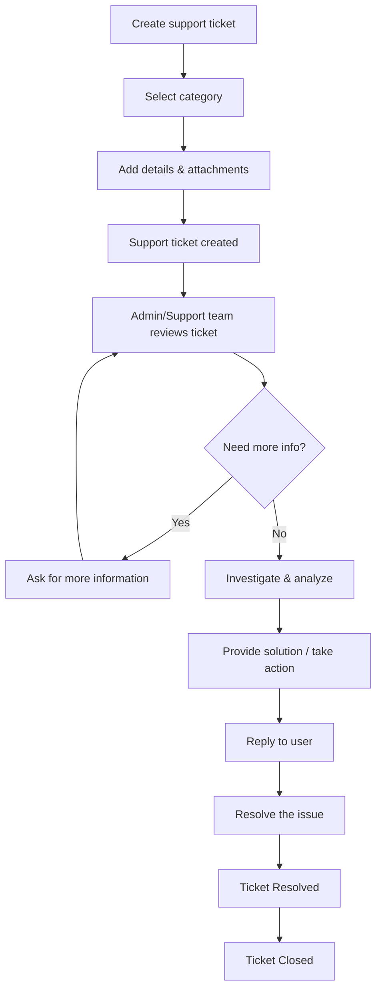

---

## 9. Cross-Cutting: Disputes

Available to **Customer, Partner, and Admin** only. **Only Customer or Partner can raise a dispute** (Admin manages/resolves).

### Customer Dispute Categories
Service Issue · Poor Quality · Service Incomplete · Damage · Refund Request

### Partner Dispute
Select booking → select category → add details & attachments (categories not fully enumerated in source — confirm with stakeholders whether partner categories mirror customer's or differ).

### Flow
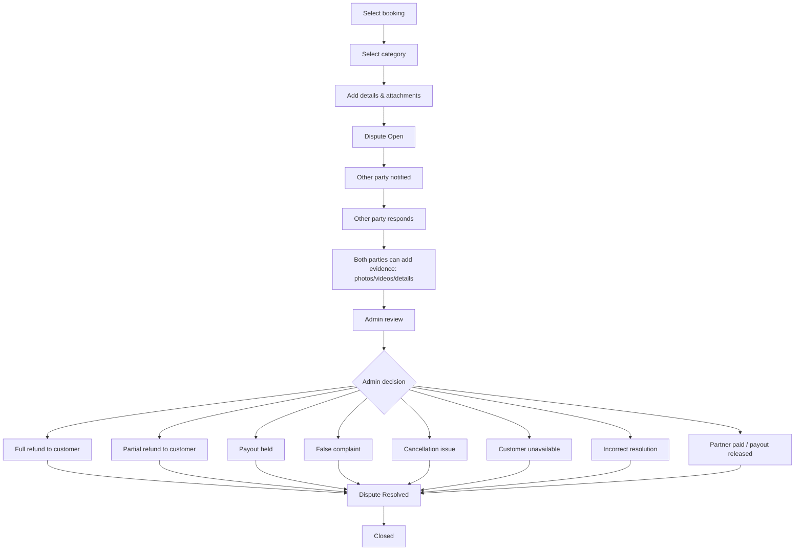

This same pipeline is what Admin drives from the [Disputes (Admin)](#611-disputes-admin) screen (ticket auto-tagging, SLA timers, fault determination, logging).

---

## 10. Open Questions / Ambiguities

Items in the original flow notes that were unclear or inconsistently ordered, reconstructed here with best-effort logic — please confirm:

1. **Payout vs Refund mix-up:** The source text interleaves "Partner Payout" and "Customer Refund Payout" steps. This doc splits them into two flows ([6.10](#610-finance-commission--payouts)) — confirm the split matches intent, especially the "Customer notified · Paid" step which was reconstructed as belonging to the refund flow, not partner payout.
2. **Partner dispute categories:** Not explicitly listed in source (only Customer's 5 categories were given). Confirm whether Partner uses the same list or a distinct one.
3. **Role Management modules:** Only "Finance" and "Operations" were explicit; "Support" and "Read-only" were implied. Confirm the full list of assignable modules/permission levels.
4. **"Only for development purpose" marker** on Customer App Payment Success step — confirm if this means a staging-only bypass, or a note to remove before production.
5. **Chat "no contact information" restriction** — confirm whether this is enforced via message filtering (regex/NLP on phone numbers, emails) or purely a pre-defined message allowlist that structurally can't contain contact info.
6. **Staff self-signup:** Staff App has no sign-up flow (only Login) — confirmed staff accounts are provisioned exclusively by their Partner via [4.4](#44-staff-management).
7. **Booking cancellation "modify address within 2 minutes"** — confirm if this 2-minute window starts at booking confirmation or is otherwise triggered.
8. **Currency/region:** Pricing shown in OMR (Omani Rial) — confirms Oman as target market; relevant for payment gateway selection and localization defaults (EN/AR).
